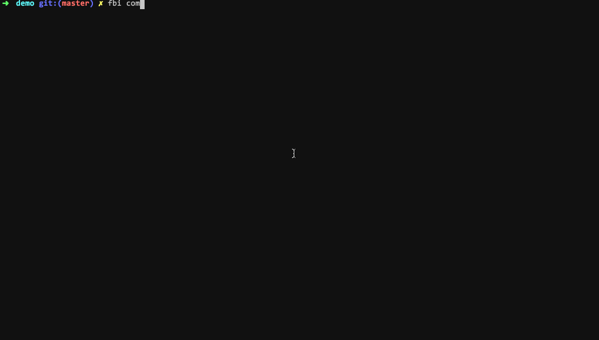

# fbi-task-commit

git commit and npm publish flow, formatting commit messages with commitizen.

> This is a fbi task. If you haven't installed [fbi](https://github.com/AlloyTeam/fbi) yet, use the following command to install.
>
> `$ npm i -g fbi` or `yarn global add fbi`



## Requirements

- `fbi v3.0+`
- `node v7.6+`

## Features

- flow of `git add`, `git commit`, `git push`, `git tag`, `npm version major/minor/patch`, `npm publish`, and changelog generation
- formatting commit messages with commitizen
- version standard: [Semantic Versioning](https://semver.org/)
- `git commit` and `changelog` style: [Angular commit style](https://docs.google.com/document/d/1QrDFcIiPjSLDn3EL15IJygNPiHORgU1_OOAqWjiDU5Y/edit#heading=h.7mqxm4jekyct)
  - commit message format: `type(scope): subject`
  - commit types: [cz-fbi](https://github.com/neikvon/cz-fbi#docs)
  - changelog: only `new features, bug fixes, breaking changes` will show in `CHANGELOG.md`

## Usage

**Install**

```bash
$ fbi add https://github.com/fbi-templates/fbi-task-commit.git
```

**Run**

```bash
$ cd path/to/git/repository
$ fbi commit
```

## More

- [Official templates](https://github.com/fbi-templates)
- [`fbi` documentation](https://neikvon.gitbooks.io/fbi/content/)

## License

[MIT](https://opensource.org/licenses/MIT)

## [Changelog](./CHANGELOG.md)
